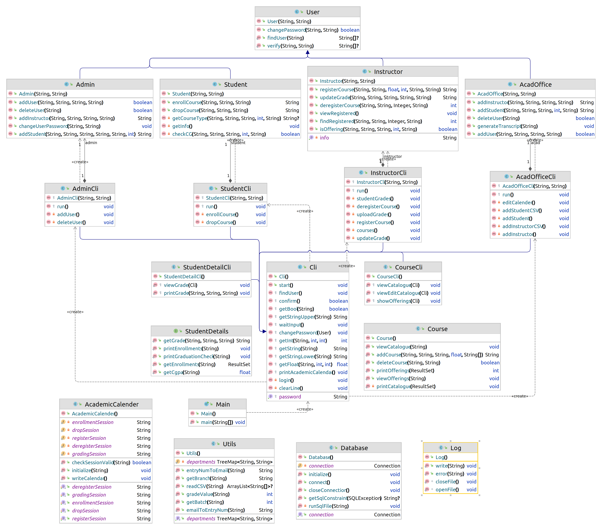
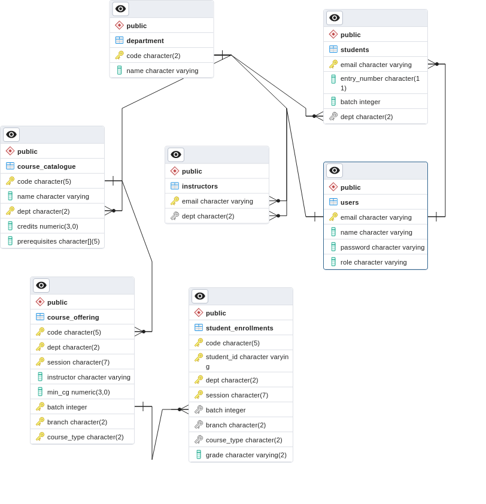
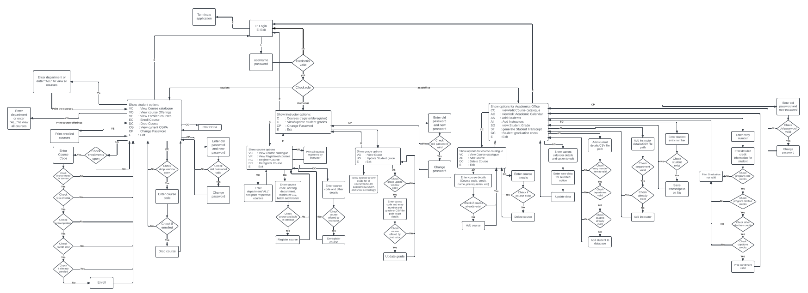

# CS305-Mini-project
A academic information management system implemented as
a terminal application in Java that interacts with PostgreSQL database. It supports login by different types of users (Students, Instructors, Academic office, etc.), and shows them relevant options. The main focus of this project is on design, object oriented concepts and testing.

# Instructions to run
1. Create database named: `cs305_mini_porject` in postgres and modify user and password in "src/main/java/org/cs305/Database.java" file if required.

2. To compile and run the code, run the following command in project folder:  `./gradlew --console plain run`

3. To run tests and generate test report:
 `./gradlew jacocoTestReport` 
code coverage be viewed at "reports/jacoco/test/html/index.html"

# Diagrams
## UML Diagram
 
Click to open [Uml_diagram.png](diagrams/Uml_diagram.png)

## ER Diagram
 
Click to open [ER_diagram.png](diagrams/ER_diagram.png)

## Activity Diagram
 
Click to open [Activity diagram.pdf](diagrams/Activity_diagram.png)

# Test Details
To test the methods that are returning the Boolean values after completion we call the method in the test function and store it's return values value to the expected true or false and used assertTrue and assertFalse.

To test void methods giving output to the terminal we take the output of the file in the output stream and match it with the expected output after copying it from the function itself

Similarly for testing the string returning methods we chech the return of the method with the expected using the assertEquals

I have created CommonTestClass to help insert sample data and test CLI using redirecting System.in from string and storing System.out to a file. 

I have also created Log file that logs almost all changes to database to a file and read that file for testing.